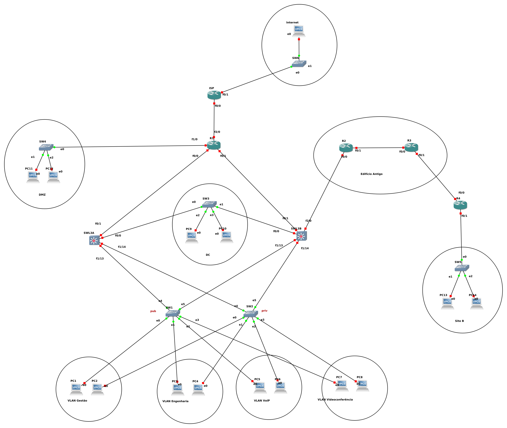

# RS - Networks and Services

This repository contains the project done for the [Networks and Services](https://www.ua.pt/en/uc/14818) course.

Protocols used in this project: IPv4, IPv6, static routing, NAT/PAT, OSPFv2, OSPFv3, RIPv2, RIPv3, BGP.

## Setup

Graphical Network Simulator 3 (GNS3): [www.gns3.com](https://www.gns3.com/)

Router 3725 Firmware Image: [Download 35.7MB](http://www.av.it.pt/salvador/LR/c3725-advipservicesk9-mz.124-21.bin)

Router 7200 Firmware Image: [Download 65.9MB](http://www.av.it.pt/salvador/LR/c7200-jk9o3s-mz.123-8.T.bin)

## Network and Address Configuration (public IPv4, private IPv4 and IPv6)

### Networks

(2) VLAN gestão:   	10.10.1.0/24, 2200:0:0:0::/64

(3) VLAN eng: 		195.5.5.0/27, 10.10.2.0/24, 2200:0:0:1::/64

(4) VLAN voip:		10.10.3.0/24, 2200:0:0:2::/64

(5) VLAN video: 	195.5.5.112/29, 10.10.4.0/24, 2200:0:0:3::/64

DC:	195.5.5.96/28, 10.10.5.0/24, 2200:0:0:4::/64

DMZ:	195.5.5.120/29, 10.10.6.10/24,2200:0:0:5::/64

Ed. antigo:	195.5.5.32/27, 10.10.7.0/24, 2200:0:0:6::/64

Site B:	195.5.5.64/27, 10.10.8.0/24, 2200:0:0:7::/64

NAT/PAT:	195.5.5.128/29

R1_SWL3A:	10.10.9.0/24, 2200:0:0:8::/64

R1_SWL3B:	10.10.10.0/24, 2200:0:0:9::/64

R2_SWL3B:	10.10.11.0/24, 2200:0:0:10::/64

### PCs

Gestão (vlan 2)  	PC1:  10.10.1.10/24,  2200::10/64

               	PC2:  10.10.1.20/24,  2200::20/64
               		    	
Eng (vlan 3)    	PC3:  195.5.5.5/27,   2200:0:0:1::10/64

			PC4:  10.10.2.10/24,  2200:0:0:1::20/64
                              	
VoIP (vlan 4)    	PC5:  10.10.3.10/24,  2200:0:0:2::10/64

                       PC6:  10.10.3.20/24,  2200:0:0:2::20/64
                              	
Videoconf (vlan 5)  	PC7:  195.5.5.117/29, 2200:0:0:3::10/64

			PC8:  10.10.4.10/24,  2200:0:0:3::20/64

DC		PC9:  195.5.5.101/28, 2200:0:0:4::10/64

            	PC10: 10.10.5.10/24,  2200:0:0:4::20/64
            	
DMZ	PC11: 195.5.5.125/29, 2200:0:0:5::10/64

	PC12: 10.10.6.10/24,  2200:0:0:5::10/64
                	
Site B	PC13: 195.5.5.69/27,  2200:0:0:7::10/64

	PC14: 10.10.8.10/24,  2200:0:0:7::20/64

### Switches and Routers

SWL3A VLAN2:  10.10.1.1/24,  2200::1/64

      	VLAN3:  195.5.5.1/27,  10.10.2.1/24,  2200:0:0:1::1/64
      	
      	VLAN4:  10.10.3.1/24,  2200:0:0:2::1/64
      	
      	VLAN5:  195.5.5.113/29,  10.10.4.1/24,  2200:0:0:3::1/64
      	
	F0/0:  195.5.5.97/28,  10.10.5.1/24,  2200:0:0:4::1/64
	
	F0/1:  10.10.9.1/24,  2200:0:0:8::1/64

SWL3B VLAN2:  10.10.1.2/24,  2200::2/64

      	VLAN3:  195.5.5.2/27,  10.10.2.2/24,  2200:0:0:1::2/64
      	
      	VLAN4:  10.10.3.2/24,  2200:0:0:2::2/64
      	
      	VLAN5:  195.5.5.114/29,  10.10.4.2/24,  2200:0:0:3::2/46
      	
	F0/0:  195.5.5.98/28,  10.10.5.2/24,  2200:0:0:4::2/64
	
 	F0/1:  10.10.10.1/24, 2200:0:0:9::1/64
       	
	F2/0:  10.10.11.1/24, 2200:0:0:10::1/64

R1 	F0/0:  10.10.9.2/24,  2200:0:0:8::2/64

	F0/1:  10.10.10.2/24,  2200:0:0:9::2/64
	
	F1/0:  195.5.5.121/29,  10.10.6.1/64,  2200:0:0:5::1/64

R2 	F0/0:  10.10.11.2/24,  2200:0:0:10::2/64

	F0/1:  195.5.5.33/27,  10.10.7.1/24,  2200:0:0:6::1/64

R3 	F0/0:  195.5.5.34/27,  10.10.7.2/24,  2200:0:0:6::2/64

## Network Topology

